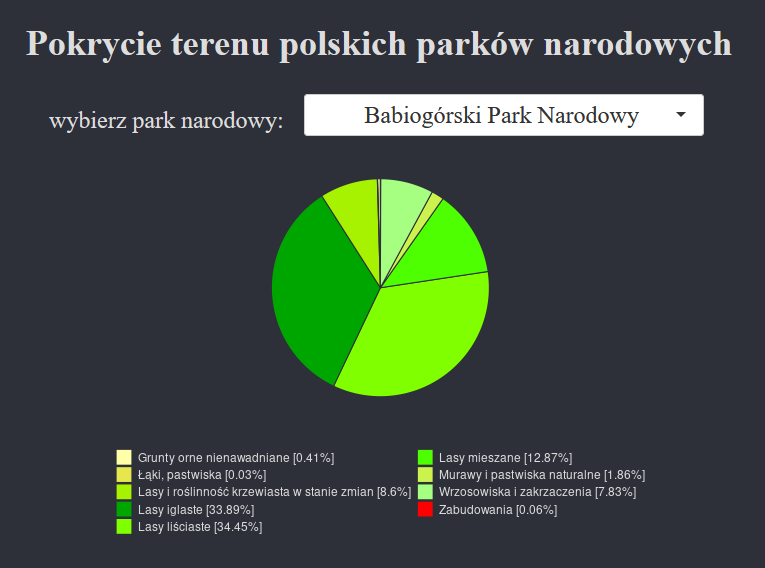

# Aplikacja parki-CLC

Ta aplikacja pozwala na wyświetlanie struktury pokrycia terenu parków narodowych w Polsce na podstawie danych CORINE Land Cover z 2018 roku.
Wybierz z listy interesujący Ciebie park narodowy, a wyświetlony zostanie dla niego wykres kołowy obrazujący jaką część powierzchni parku zajmuje każdy z występujących tam typów pokrycia terenu.

Aplikacja powstała jako element projektu w ramach Sekcji Geoinformacji SKNG UAM mającego na celu stworzenie interaktywnej mapy parków narodowych i krajobrazowych w Polsce.

## Korzystanie

### RStudio + GitHub 
```r
shiny::runGitHub("parki-CLC", "TomekMatuszek")
```

### Portal shinyapps.io

Aplikacja została również opublikowana na portalu shinyapps.io pod linkiem [https://kemot00.shinyapps.io/app_parki/?_ga=2.121546312.1704183705.1649167086-1543548998.1649167086](https://kemot00.shinyapps.io/app_parki/?_ga=2.121546312.1704183705.1649167086-1543548998.1649167086)


